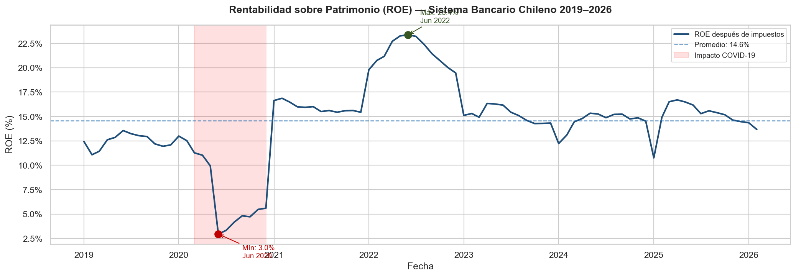
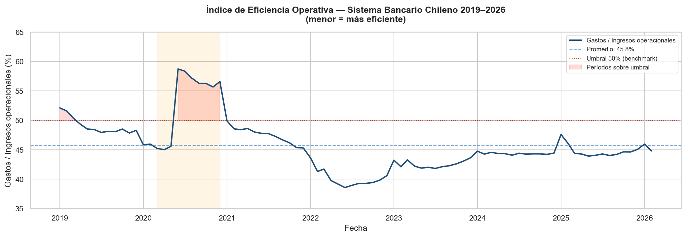
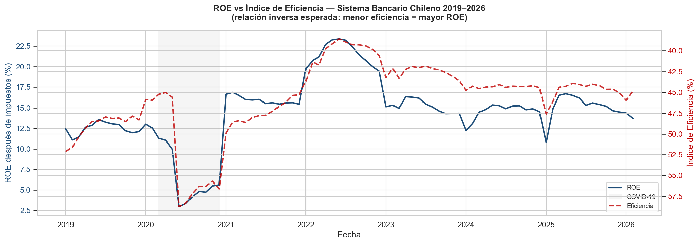
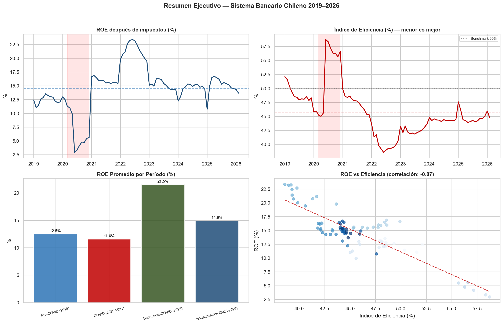
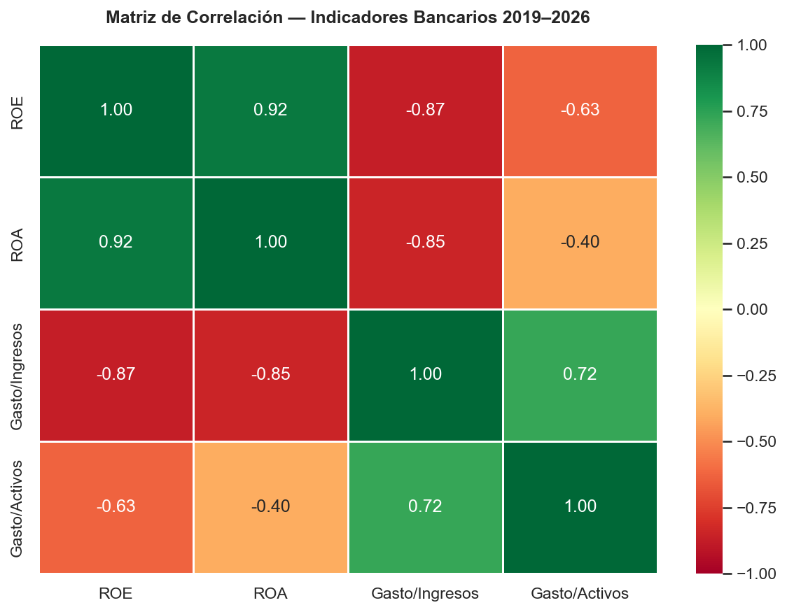

# Análisis de Rentabilidad y Eficiencia del Sistema Bancario Chileno

**Python (pandas, matplotlib, seaborn) + Datos reales CMF** | 2019–2026

---

## Contexto del Negocio

El sistema bancario chileno opera bajo supervisión de la Comisión para el Mercado Financiero (CMF), que publica mensualmente indicadores de rentabilidad y eficiencia operativa de cada institución y del sistema consolidado.

Desde mi experiencia trabajando en control de gestión en Banco Santander Chile, entiendo que dos métricas son fundamentales para evaluar la salud financiera de un banco: el **ROE** (Return on Equity — rentabilidad sobre patrimonio) y el **Índice de Eficiencia** (ratio gastos operacionales / ingresos operacionales). Un banco bien gestionado maximiza su ROE mientras mantiene su índice de eficiencia bajo control.

Este proyecto analiza la evolución de ambas métricas para el sistema bancario chileno completo entre 2019 y 2026, con foco en los eventos que más las impactaron: la pandemia COVID-19, el ciclo de tasas altas post-pandemia, y la normalización reciente.

---

## Problema de Negocio

> **¿Cómo han evolucionado la rentabilidad y eficiencia operativa del sistema bancario chileno entre 2019 y 2026, y qué relación existe entre ambas métricas?**

Preguntas específicas:
1. ¿Cuánto impactó el COVID-19 en la rentabilidad del sistema?
2. ¿En qué períodos el sistema superó el benchmark internacional de eficiencia del 50%?
3. ¿Existe correlación estadística entre eficiencia operativa y rentabilidad?
4. ¿Cuál es la tendencia en los últimos 12 meses?

---

## Fuente de Datos

**Comisión para el Mercado Financiero (CMF) — BEST Platform**
- URL: [www.best-cmf.cl](https://www.best-cmf.cl)
- Datos públicos, actualizados mensualmente
- Período analizado: enero 2019 – febrero 2026 (86 observaciones mensuales)
- Sin transformaciones sobre los datos originales — se usan tal como los publica la CMF

### Variables analizadas

| Variable | Descripción | Unidad |
|---|---|---|
| ROE después de impuestos | Rentabilidad sobre patrimonio neto | % anual |
| ROA después de impuestos | Rentabilidad sobre activos totales | % anual |
| Gastos / Ingresos operacionales | Índice de eficiencia principal | % |
| Gastos / Activos totales | Índice de eficiencia secundario | % |

---

## Metodología

```
Descarga CMF (Excel) → Carga con pandas → Limpieza y normalización
→ Análisis exploratorio → Análisis por períodos → Correlación estadística
→ Visualizaciones → Hallazgos y conclusiones
```

---

## Análisis Python — Paso a Paso

### Librerías utilizadas

```python
import pandas as pd        # Manipulación de datos (equivalente a SQL + Excel)
import matplotlib.pyplot as plt  # Gráficos base
import matplotlib.ticker as mticker
import seaborn as sns      # Visualizaciones estadísticas
import numpy as np         # Operaciones numéricas (línea de tendencia)
import warnings
```

### Limpieza de datos

Los archivos del CMF presentan los desafíos típicos de datos institucionales reales:
- Primeras filas con títulos y metadatos (resuelto con `skiprows=3`)
- Nombres de columnas en español con acentos y espacios (renombrados a snake_case)
- Valores nulos en períodos sin datos históricos (convertidos con `pd.NA`)
- Columnas numéricas en formato texto (convertidas con `pd.to_numeric(errors='coerce')`)

```python
rentabilidad = pd.read_excel('CMF_CONT_RENTAB_STO_RAZ_PORC_MONT_V_...xlsx',
                              sheet_name='Cuadro', skiprows=3)

# Filtro principal: análisis desde 2019
rent_reciente = rentabilidad[rentabilidad['fecha'] >= '2019-01-01'].copy()
```

---

## Estadísticas Descriptivas (2019–2026)

### Rentabilidad

| Métrica | ROE (%) | ROA (%) |
|---|---|---|
| Promedio | 14,59 | 1,11 |
| Desviación estándar | 4,23 | 0,31 |
| Mínimo | 2,95 | 0,19 |
| Máximo | 23,38 | 1,62 |

### Eficiencia Operativa

| Métrica | Gastos/Ingresos (%) |
|---|---|
| Promedio | 45,79 |
| Mínimo | 38,59 |
| Máximo | 58,74 |

---

## Análisis por Períodos

| Período | ROE Promedio | ROE Mín | ROE Máx | Eficiencia Prom |
|---|---|---|---|---|
| Pre-COVID (2019) | 12,5% | 11,1% | 13,6% | 48,6% |
| COVID (2020-2021) | 11,6% | 3,0% | 16,9% | 50,2% |
| Boom post-COVID (2022) | 21,5% | 19,5% | 23,4% | 40,1% |
| Normalización (2023-2026) | 14,9% | 10,8% | 16,7% | 44,0% |

---

## Visualizaciones

### Evolución del ROE (2019–2026)


### Índice de Eficiencia Operativa


### ROE vs Eficiencia — Relación Inversa


### Resumen Ejecutivo — 4 Paneles


---

## Hallazgos y Decisiones de Negocio

| Hallazgo | Evidencia | Implicancia |
|---|---|---|
| **Correlación ROE-Eficiencia: -0,87** | Estadísticamente fuerte | El control de gastos operacionales explica la mayor parte de la variación en rentabilidad del sistema |
| **COVID impacto severo y acotado** | ROE cayó a 3,0% en jun-2020 | El sistema tocó fondo pero se recuperó en menos de 18 meses |
| **2022: el mejor año del período** | ROE de 23,4% con eficiencia de 40% | Tasas altas + eficiencia máxima = rentabilidad récord post-pandemia |
| **Sistema bajo benchmark 50% en 76 de 86 meses** | 88% del período analizado | El sistema bancario chileno opera eficientemente respecto al estándar internacional |
| **Tendencia reciente (últimos 12 meses)** | ROE promedio 15,3%, eficiencia 44,6% | Normalización saludable — ni euforia de 2022 ni estrés de 2020 |

---

## Correlación Estadística



La correlación de Pearson entre ROE y el Índice de Eficiencia es de **-0,87**, indicando una relación negativa fuerte y estadísticamente significativa.

**Interpretación de negocio:** por cada punto porcentual que sube el ratio de eficiencia (es decir, los gastos crecen más que los ingresos), el ROE del sistema tiende a caer proporcionalmente. Esto confirma que la gestión del gasto operacional es el principal lever de rentabilidad en la banca chilena — no solo el volumen de negocio.

---

## Limitaciones del Análisis

- **Datos consolidados del sistema:** el análisis no distingue entre bancos individuales. Santander, BCI, Banco de Chile y bancos pequeños se promedian en una sola cifra. Un análisis por institución revelaría heterogeneidad importante.
- **Sin ajuste por ciclo de tasas:** parte de la variación en rentabilidad refleja el ciclo de tasas del Banco Central (TPM), no solo eficiencia operativa. Un análisis más completo incorporaría la TPM como variable de control.
- **Sin dimensión de riesgo de crédito:** el índice de pérdidas crediticias sobre ingresos no se incorporó al análisis principal. En períodos de stress (2020), este indicador explica parte adicional del deterioro del ROE.
- **Período de 7 años:** aunque suficiente para capturar un ciclo completo (pre-COVID, crisis, recuperación, normalización), no permite análisis de ciclos más largos (crisis 2008-2009 requeriría data desde 2006).

---

## Próximos Pasos

- **Análisis por banco individual:** desagregar los indicadores por institución usando los datos individuales de la CMF para identificar qué bancos son más eficientes
- **Incorporar variable TPM:** correlacionar el ROE con la Tasa de Política Monetaria del Banco Central para separar el efecto tasa del efecto eficiencia
- **Forecasting simple:** proyectar el ROE para los próximos 6 meses usando regresión lineal o promedio móvil
- **Comparativa internacional:** incorporar datos de bancos de Brasil, Colombia y Perú via yfinance para contextualizar los indicadores chilenos en la región

---

## Estructura del Repositorio

```
analisis-bancario-chile/
├── analisis_bancario_chile.ipynb   # Notebook completo con todo el análisis
├── visuals/
│   ├── grafico_roe.png             # Evolución ROE 2019-2026
│   ├── grafico_eficiencia.png      # Índice de eficiencia operativa
│   ├── grafico_roe_vs_eficiencia.png  # Relación inversa dual-eje
│   ├── grafico_correlacion.png     # Heatmap matriz de correlación
│   └── resumen_ejecutivo.png       # Dashboard 4 paneles
└── README.md
```

> **Nota sobre los datos:** los archivos Excel originales del CMF no están incluidos en el repositorio por su tamaño. Se descargan directamente desde [www.best-cmf.cl](https://www.best-cmf.cl) → Bancos e Inst. Financieras → Desempeño → Bancos → Sistema → Rentabilidad y Eficiencia operativa. Rango: 01/2019 – presente.

---

## Stack Técnico

- **Python 3** — pandas, matplotlib, seaborn, numpy
- **Jupyter Notebook** — entorno de análisis
- **Fuente de datos** — CMF Chile (BEST Platform), datos públicos oficiales

---

*Proyecto de portafolio | Cristian De La Barra Díaz — Finance Data Analyst*
*linkedin.com/in/cristian-de-la-barra · github.com/CristianDelaBarra30*
